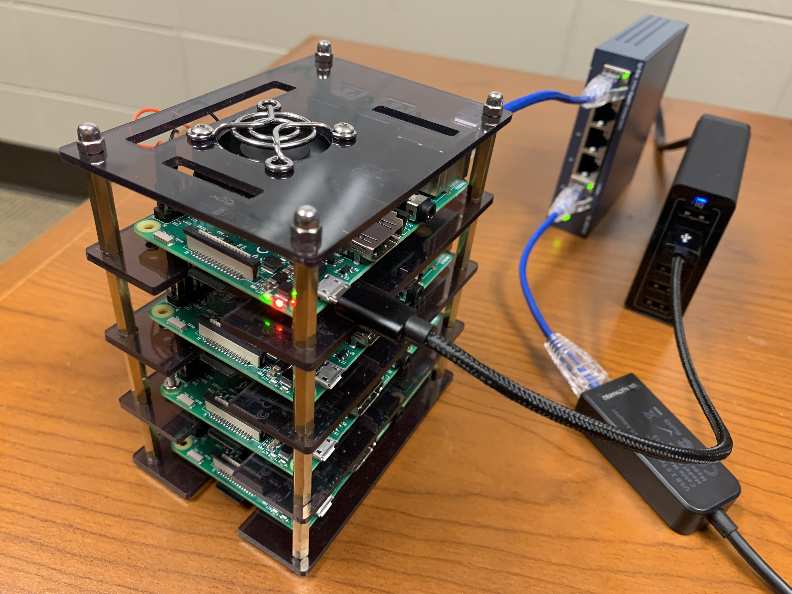
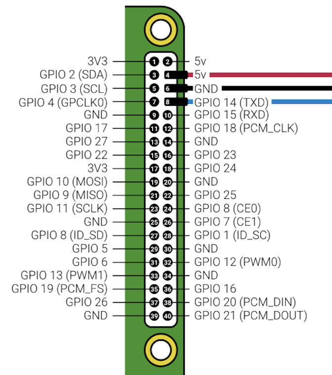
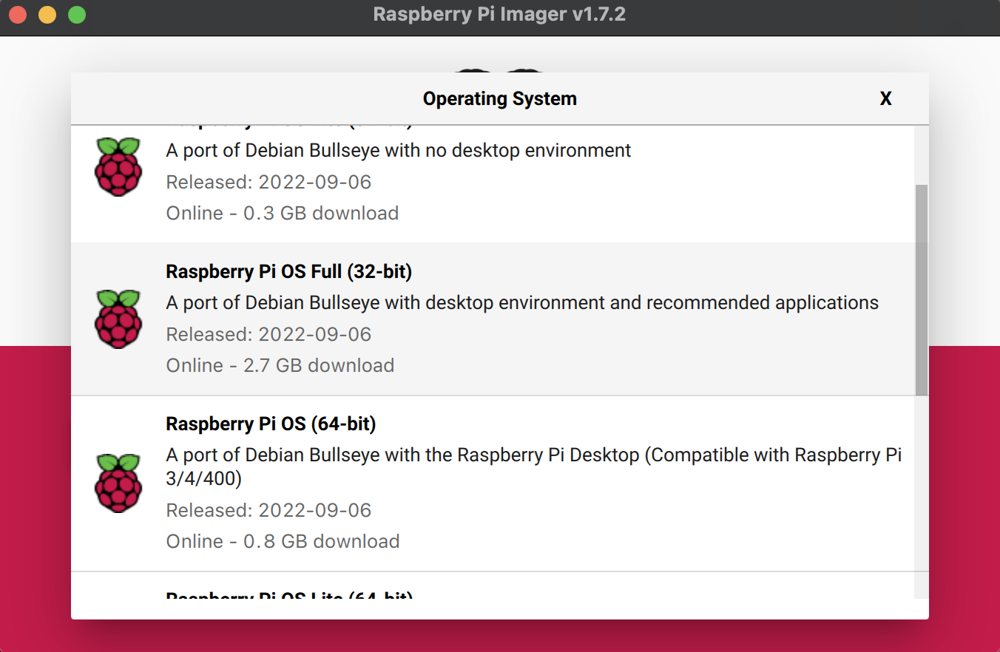
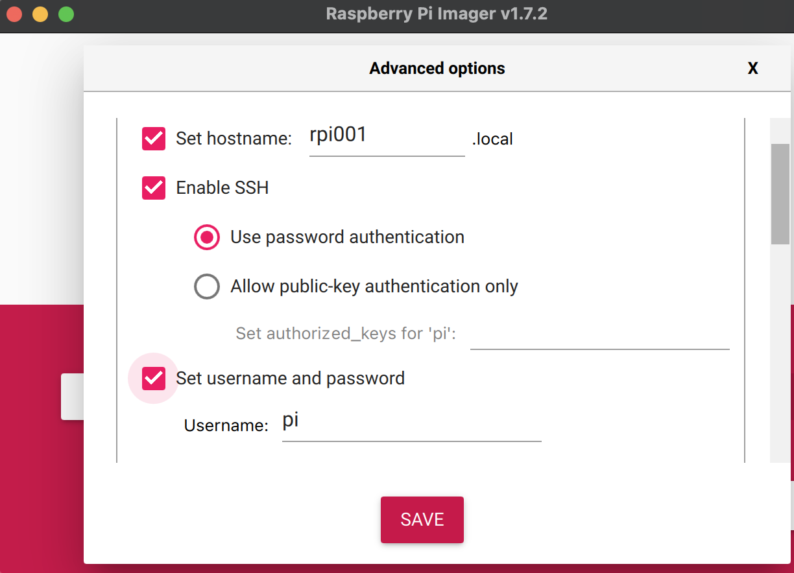
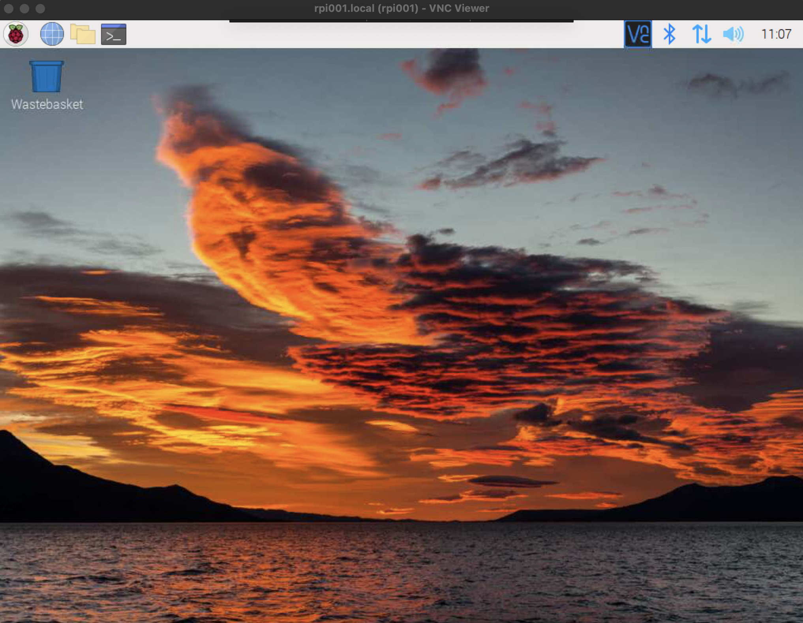

In this blog series, we are going to build a cluster of four Raspberry Pi's in two phases.

In the first phase of the __Raspberry Pi Cluster__ project, we will first build a cluster with just a single active node. Specifically, we will

- stack up four Raspberry Pi boards using a cluster case
	
	> Although only one out of four Pi's is used in this phase, assembly of the physical cluster is completed for the sake of time and logistics.
	
- install the lastest Raspberry Pi OS on __one Raspberry Pi board__ (the top one on the cluster named `rpi001`
- and connect `rpi001` to your computer
	
Then using `rpi001`, which has four CPU cores and a shared 1GB RAM, we will discuss and practice with <span style="color:red">__openMP__</span>  -- a paradigm of parallel programming through shared-memory.
	
 The following is how this single-node cluster looks like: 
	
 

###1. Parts list

All of the following parts are provided by the instructor.

- Raspberry Pi 3 Model B, Quad Core, 1 GB RAM ( $\times 4$ )
- MicroSD Card, 32 GB ( $\times 4$ )
- 4 Layer Raspberry Pi Stackable Cluster Case with Cooling Fan ( $\times 1$ )
- 5 Port Gigabit Unmanaged Ethernet Network Switch ( $\times 1$ )
- Cat6 Ethernet Cable, 0.5 Feet ( $\times 5$ )
- USB to Ethernet Adapter ( $\times 1$ )
- 6 Port USB Charging Station ( $\times 1$ )
- USB to Micro USB Charging Cable, 8 inches ( $\times 4$ )

###2. Assembling the cluster

Open the Raspberry Pi Stackable Cluster Case and follow the assembly instructions to build a cluster of four Raspberry Pi's as shown in the picture above. Pay special attentions to the following bullets though:

- The stackable cluster case comes with screws of two sizes. Since the short ones are too short, we will have to use the longer ones to mount all four Pi boards and all four cooling fans. Unfortunately, there isn't enough number of such long screws. So we will use __two screws (instead of four) to diagnally secure each borad and each fan on the panel__.	
- Don't tighten the screws too much, or you might bend or even damage the boards.
- Make sure the screws are not touching any of the circuits.
- All the cooling fans should face down and connect to the Raspberry Pi's GPIO pins as shown below (the blue lead can be ignored)
- The heat sinks are optional.


	

###3. Installing Raspberry Pi OS

Download the [Raspberry Pi Imager](https://www.raspberrypi.com/software/) application and install it on your computer. Take a microSD card and connect it to your computer. 

> You might need a SD card adapter (they normally come with microSD cards) or an SD card USB reader if your computer doesn’t have a slot for SD cards.
> 
> <span style="color:red">__DO NOT FORMAT__</span> the microSD card when prompted.

- Click on CHOOSE OS and pick the Raspberry Pi OS as shown below:

	
	
- Click on CHOOSE STORAGE and select your microSD card. 
- Click on the “gear” icon
	- 	Set hostname as <span style="color:red">__rpi001__</span>.local
	-  Check Enable SSH and Use password authentication options
	-  Set a username to <span style="color:red">__pi__</span> and type the password <span style="color:red">__raspberry__</span>
	-  Check locale settings and ensure the time zone and keyboard layout are correct

	

Now you can click SAVE and then WRITE to start the installation process. Once completed, eject the card and connect it to the Raspberry Pi that sits on the __top__ of the cluster stack.

###4. Access the Pi

####4.1. SSH to the Pi

We are now ready to access the Pi `rpi001` from our computer.

- Connect a USB cable to the Pi `rpi001` and the multi-USB charger
- Connect an Ethernet cable to the Pi `rpi001` and the Ethernet switch (Port 1)
- Connect an Ethernet cable to your computer (possibly through a USB to Ethernet Adapter) and the Ethernet switch (Port 5)
- Power on both the  multi-USB charger and the Ethernet switch

Wait until the green LED changes from constantly on to flashing (the red LED stays on). Now access the Raspberry Pi through SSH from your computer:

```
> ssh pi@rpi001.local
pi@rpi001.local's password:


pi@rpi001:~ $

```
> Of course, on Windows, you can also SSH to `rpi001` using the [PuTTY](https://www.putty.org/) program.

####4.2. Configure localisation

Run the following command on `rpi001`. 

```
pi@rpi001:~ $ sudo raspi-config
```

> `sudo` above means you are runing this command as the super user.

Then use your keyboard to choose `Localisation Options` then `WLAN Country`, go down the list and choose `US United States`. If prompted, reboot the Pi.

####4.3. Enbale the VNC server

SSH back into `rpi001`. 

- Run the `sudo raspi-config` command again. 
- This time, choose `Interface Options` then `VNC`. 
- Choose `Yes` for "Would you like the VNC Server to be enabled?" to Enable the VNC server.
- Choose `Finish` to quit from `raspi-config`.

In the next step, you will connect to the VNC server running on your Pi from a VNC viewer/client running on your computer.

Run the following command to reboot the Pi.

```
pi@rpi001:~ $ sudo reboot
```

> To reboot your Pi, of course you could always power it off and power it back on. But this is not considered safe.


####4.4. Connect the Pi to the Inernet through WiFi

- (If you are off VSU campus, skip this step) 
	
	On VSU campus, you must first register your Respberry Pi.
		
	- Run the `ifconfig` command in the SSH terminal to `rpi001.local`, where you need to look for __the MAC Address of its wireless network interface__:
		
		In the `wlan0` section, locate and copy the MAC address on the line that begins with `ether`. The format of the MAC address is `xx:xx:xx:xx:xx:xx`.
		  
	- Open a browser on your local computer and go to [mydevices.valdosta.edu](mydevices.valdosta.edu)

		Log yourself in. Click Add. Type `rpi001` as the Device Name, paste the MAC address your copied above, leave the description field empty, and click Submit to register `rpi001`. 
		
		> Note: you can register up to five devices that you want to connect to the "VSU-IOT" WiFi on VSU campus.

- On your local computer, download and install [VNC Viewer](https://www.realvnc.com/en/connect/download/viewer/).

	- Launch VNC Viewer
	- Choose `File` then `New Connection...`. Type `rpi001.local` as the VNC Server and click `Ok`.
	- Double-click the `rpi001.local` graphic. On the pop-up window that says "VNC Server Not Recognized", click `Continue`. 
	- Login as `pi`.

	The following is the GUI that you will get:

	

- Click the double-arrow graphic on the top-right corner of VNC Viewer and pick the WiFi that you want to connect to. 

	- If at home, wait until you are connected wirelessly.
	- On VSU campus, choose <span style="color:red">__VSU-IOT__</span>. 

	If all steps went well, congratulations, your Pi is now connected to the Internet through WiFi.
	
	> Note: 
	>
	> - Click the Web Browser graphic on the top-left corner of VNC Viewer and go to a web site of your choice to verify that you are truly online now. Alternatively, you could simply run `ping google.com` in the SSH terminal.
	>
	> - Run `ifconfig` on the SSH terminal to `rpi001` to get the IP address of its wireless network interface. 
	>	
	> 	In the `wlan0` section, locate and copy the IP address on the line that begins with `inet`. The format of the IP address is usually `x.x.x.x`.
	>
	>   Through that IP adress, you can now SSH to `rpi001` from any computer wirelessly (of course, that computer is assumed to be on the same WiFi network).
	>
	> 	```
	> 	> ssh pi@x.x.x.x
	> 	```	
	

####4.5. Update the Pi

To wrap it up, in the SSH terminal to `rpi001`, run the following commands to update and reboot the Pi.

```
pi@rpi001:~ $ sudo apt update
pi@rpi001:~ $ sudo reboot
```

----

Happy Coding in Parallel!