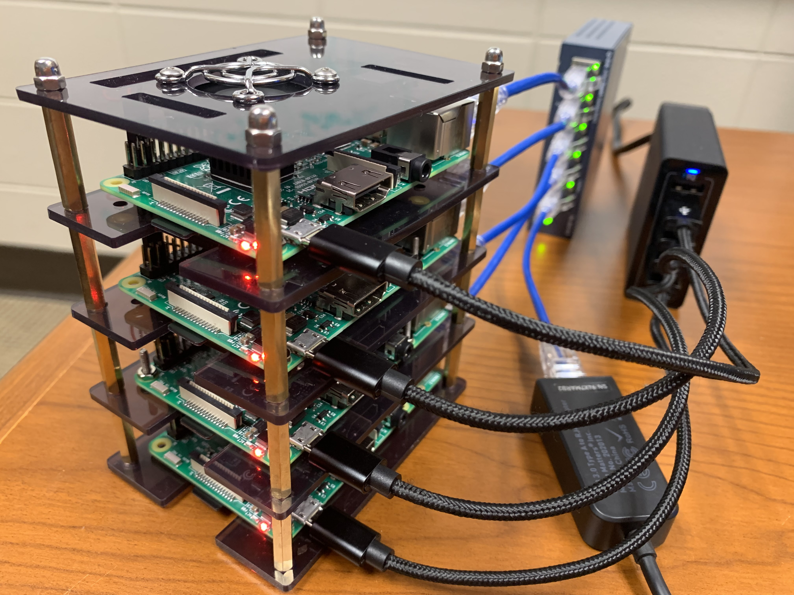

This is the second phase of the __Raspberry Pi Cluster__ project.

We will actually build a cluster of four nodes that work together as a single system. Specifically, we will 
	
- install the Raspberry Pi OS on all Pi's 
- perform necessry cluster configurations inscluding setting up NFS
- install MPICH to test the cluster

Then on this Raspberry Pi Cluster of four nodes (which don't share memory, aka. distributed memory), we will discuss and practice with <span style="color:red">__MPI__</span> (Message Passing Interface) -- a paradigm of parallel programming through message passing.
	
 The following is how the final product looks like: 
	
 
 
### 1. Install Raspberry Pi OS on all other three Pi's

Redo __Step 3 of Phase I__ to install the Raspberry Pi OS on three microSD cards:

- Make sure you set the respective hostnames as <span style="color:red">__rpi002__</span>.local, <span style="color:red">__rpi003__</span>.local, and <span style="color:red">__rpi004__</span>.local 

	> Tip: you are suggested to write a number on each microSD card using a sharpie so you don't get them mixed up.
	
- Connect each completed microSD card in one Pi on the cluster stack
- Power off both the USB charging station and the Ethernet switch then power them back on


### 2. Assign static IP addresses to the Pi's

The four Pi's on the cluster might get dynamic (i.e. different) IP addresses through the DHCP protocol every time the cluster reboots. This might not be convenient for us, especially when working on MPI parallel programming later. So, insead, we will configure the Pi's so they are assigned static IP addresses that will never change.

- SSH to `rpi001`, edit the file `/etc/dhcpcd.conf` by adding the following lines to its end so that <span style="color:red">172.27.0.11</span> becomes the static IP address of `rpi001` (you need to do it with `sudo`).

	<code>__/etc/dhcpcd.conf__:</code>
	
	<pre>
	...
	...
	...
	
	interface eth0
	metric 302
	static ip_address=<span style="color:red">172.27.0.11</span>
	static routers=172.27.0.1
	static domain_name_servers=172.27.0.1
	nolink
	
	interface wlan0
	metric 202
	</pre>
	
	Then run `sudo reboot` such that the change above will take effect.
	
- SSH to the other three nodes and do the same as above except that 
	- use <span style="color:red">172.27.0.12</span> on `rpi002`
	- use <span style="color:red">172.27.0.13</span> on `rpi003`
	- use <span style="color:red">172.27.0.14</span> on `rpi004`

- Wait till all the Pi's are ready, then ssh back to them.

	On `rpi001`, install and run the `nmap` command to verify that all four static IP address are properly detected.
	
	```
	pi@rpi001:~ $ sudo apt install nmap
	pi@rpi001:~ $ nmap -sP 172.27.0.*
	Starting Nmap 7.80 ( https://nmap.org ) at 2023-01-10 17:40 EDT
	Nmap scan report for 172.27.0.11
	Host is up (0.00038s latency).
	Nmap scan report for 172.27.0.12
	Host is up (0.0055s latency).
	Nmap scan report for 172.27.0.13
	Host is up (0.0015s latency).
	Nmap scan report for 172.27.0.14
	Host is up (0.0012s latency).
	Nmap done: 256 IP addresses (4 hosts up) scanned in 9.68 seconds
	```
	
### 3. Connect all Pi's to the Inernet through WiFi

Redo __Steps 4.2 through 4.5 of Phase I__ on `rpi002`, `rpi003`, and `rpi004` to accesss themm through VNC viewer and connect them all to the Internet through WiFi.

### 4. Configure the cluster manager node (`rpi001`) and the worker nodes (all other nodes)

As of now, our Raspberry Pi Cluster is a homogeneous cluster where all four nodes are essentially the same. However, in the reality of parallel programming such of MPI, one of the nodes stands out as the __manager__ whereas the others are __workers__. 

We are going to configure `rpi001` as the manager node.


#### 4.1. SSH keys exchange

First of all, we will allow the manager to connect to each worker node via SSH __without password__, an underlying mechanism that MPI relies on.

- On the manager node `rpi001`,
	- Run the following command (__hit enter twice__ to accept the default path and no password)

		```
		pi@rpi001:~ $ ssh-keygen -t rsa
		```
		
		This command generates two keys in the `/home/pi/.ssh` folder:
		- `id_rsa`: your private key, keep it here
		- `id_rsa.pub`: the public key, you need to send it to peer nodes you want to access without password

	- Send the public key to the worker nodes

		```
		pi@rpi001:~ $ scp /home/pi/.ssh/id_rsa.pub pi@172.27.0.12:/home/pi/master.pub
		pi@rpi001:~ $ scp /home/pi/.ssh/id_rsa.pub pi@172.27.0.13:/home/pi/master.pub
		pi@rpi001:~ $ scp /home/pi/.ssh/id_rsa.pub pi@172.27.0.14:/home/pi/master.pub
		```
- On the worker node `rpi002`, run the following commands to register `rpi001`'s public key

	```
	pi@rpi002:~ $ mkdir .ssh
	pi@rpi002:~ $ cat master.pub >> .ssh/authorized_keys
	pi@rpi002:~ $ rm master.pub
	```
- Do the same above on <span style="color:red">__the other two worker nodes `rpi003` and `rpi004`__</span>.

- Back on the manager node `rpi001`, try to ssh to the worker nodes one by one. You should be able to do so without having to type the password like before.

	<pre>
	pi@rpi001:~ $ <span style="color:red">ssh pi@rpi002.local</span>
	
	....
	.... ==> your are on rpi002
	.... 
	
	pi@rpi002:~ $ <span style="color:red">exit</span>
	pi@rpi001:~ $ <span style="color:red">ssh pi@rpi003.local</span>
	
	....
	.... ==> your are on rpi003
	.... 
	
	pi@rpi003:~ $ <span style="color:red">exit</span>
	pi@rpi001:~ $ <span style="color:red">ssh pi@rpi004.local</span>
	
	.... 
	.... ==> your are on rpi004
	.... 
	
	pi@rpi004:~ $ <span style="color:red">exit</span>
	pi@rpi001:~ $
	</pre>


#### 4.2. Setting up NFS

As you will see later when working on MPI, a parallelized executable code has to be residing on __ALL__ nodes before it could run on them. However, it is tedious if we have to copy the executable to all nodes across the cluser everytime we make some changes to a program and compile it. The issue could be solved using NFS.

You share a directory via NFS in __manager__ which the __worker__ mounts to exchange data. An executable code placed in the shared folder on the manager node will be auatomatically available on all others.

##### 4.2.1. NFS Server

- Install NFS server on __manager__:

	```
	pi@rpi001:~ $ sudo apt-get install nfs-kernel-server 
	```

- Now, let’s create a folder by the name `nfs-shared` that we will share across the network.
	
	```
	pi@rpi001:~ $ cd                 # make sure you are in the home folder
	pi@rpi001:~ $ mkdir nfs-shared
	```

- To export the `nfs-shared` directory, add the following entry to `/etc/exports` as a super user.

	<code>__/etc/exports__:</code>
	
	```
	/home/pi/nfs-shared *(rw,sync,no_root_squash,no_subtree_check) 
	```
	
	> Here, instead of `*`, you can specifically give out the IP address to which you want to share this folder to. But, `*` (i.e., all IP addresses) will just make our job easier.
	
	> Permissions:
	
	> - __rw__: This is to enable both read and write option. __ro__ is for read-only.
	> - __sync__: This applies changes to the shared directory only after changes are committed.
	> - __no\_subtree\_check__: This option prevents the subtree checking. When a shared directory is the subdirectory of a larger filesystem, nfs performs scans of every directory above it, in order to verify its permissions and details. Disabling the subtree check may increase the reliability of NFS, but reduce security.
	> - __no\_root\_squash__: This allows root account to connect to the folder.

	After you have made the entry, run the following to export it:
	
	```
	pi@rpi001:~ $ sudo exportfs -a
	```
	
	> Note: the command above needs to be run every time you make a change to `/etc/exports`.
	
- Restart the NFS server

	```
	pi@rpi001:~ $ sudo service nfs-kernel-server restart
	```
	

##### 4.2.2. NFS Worker

Let's configure one __worker__ node `rpi002`:

- Install NFS common (which might have already been installed by default)

	```
	pi@rpi002:~ $ sudo apt-get install nfs-common
	```
	
- Create a directory in the worker’s machine with the same name `nfs-shared`.

	```
	pi@rpi002:~ $ cd               # make sure you are in the home folder
	pi@rpi002:~ $ mkdir nfs-shared
	```
	
- And now, mount the shared directory

	<pre>
	pi@rpi002:~ $ sudo mount -t nfs <span style="color:green">rpi001.local:/home/pi/nfs-shared</span> <span style="color:blue">~/nfs-shared</span>
	pi@rpi002:~ $ #                 <span style="color:green">remote</span>  <span style="color:blue">                         local mount point</span>
	</pre>
	
- To check the mounted directories

	```
	pi@rpi002:~ $ df -h
	pi@rpi002:~ $ # make sure the shared folder has been mounted
	```
	
- To make the mount __permanent__ so you don’t have to manually mount the shared directory everytime you do a system reboot, create an entry in your file systems table - i.e., `/etc/fstab` file like this (you need to do this as super user):

	<code>__/etc/fstab__:</code>
	
	
	<code>
	rpi001.local:/home/pi/nfs-shared /home/pi/nfs-shared nfs defaults,user,exec,noauto,x-systemd.automount
	</code>
	
	> Note: the entry above is a long line so make sure you copy it entirely.

Now do the steps above on <span style="color:red">the other two __worker__ nodes `rpi003` and `rpi004`</span>:	
	
	
### 5. Test the cluster with MPI

- First, on the manager node <span style="color:red">`rpi001`</span>, install `mpich` -- a popular implementation of MPI.
	
	```
	pi@rpi001:~ $ sudo apt install mpich
	```
	
	Install `mpich` on <span style="color:red">__ALL WORKER NODES__</span> too.
	
- Then on the manager node `rpi001`, 
	- In the home folder `/home/pi`, create a file named  `hosts` and add the IP addresses of all nodes:

		```
		pi@rpi001:~ $ cd            # make sure you are in the home folder
		```

		<code>__/home/pi/hosts__:</code>
		
		```
		172.27.0.11 slots=4
		172.27.0.12 slots=4
		172.27.0.13 slots=4
		172.27.0.14 slots=4
		```
		> Note: you could customize the number of slots on each host that you want to contribute to the cluster.
		
	- In the NFS shared folder, create a new folder `MPI`. Then create a simple MPI program that will say "hi" from all four nodes when it runs:

		```
		pi@rpi001:~ $ cd nfs-shared
		pi@rpi001:~/nfs-shared $ mkdir MPI; cd MPI
		pi@rpi001:~/nfs-shared/MPI $
		```
		
		<code>__/home/pi/nfs-shared/MPI/hi_mpi.c__:</code>
		
		```c
		#include <mpi.h>
		#include <stdio.h>
		
		int main(int argc, char** argv) {
		    // Initialize the MPI environment
		    MPI_Init(NULL, NULL);
		
		    // Get the number of processes
		    int world_size;
		    MPI_Comm_size(MPI_COMM_WORLD, &world_size);
		
		    // Get the rank of the process
		    int world_rank;
		    MPI_Comm_rank(MPI_COMM_WORLD, &world_rank);
		
		    // Get the name of the processor
		    char processor_name[MPI_MAX_PROCESSOR_NAME];
		    int name_len;
		    MPI_Get_processor_name(processor_name, &name_len);
		
		    // Print off a hello world message
		    printf("Hello world from processor %s, rank %d out of %d processors\n",
		           processor_name, world_rank, world_size);
		
		    // Finalize the MPI environment.
		    MPI_Finalize();
		}
		```
		
		Now, compile the program and run it.
		
		<pre>
		pi@rpi001:~/nfs-shared/MPI $ mpicc -o hi_mpi hi_mpi.c
		pi@rpi001:~/nfs-shared/MPI $ mpirun <span style="color:blue">-n 16</span> <span style="color:red">-hostfile ~/hosts</span> ./hi_mpi
		Hello world from processor rpi001, rank 0 out of 16 processors
		Hello world from processor rpi001, rank 4 out of 16 processors
		Hello world from processor rpi003, rank 2 out of 16 processors
		Hello world from processor rpi004, rank 3 out of 16 processors
		Hello world from processor rpi002, rank 1 out of 16 processors
		Hello world from processor rpi001, rank 8 out of 16 processors
		Hello world from processor rpi003, rank 6 out of 16 processors
		Hello world from processor rpi004, rank 7 out of 16 processors
		Hello world from processor rpi002, rank 5 out of 16 processors
		Hello world from processor rpi001, rank 12 out of 16 processors
		Hello world from processor rpi003, rank 10 out of 16 processors
		Hello world from processor rpi004, rank 11 out of 16 processors
		Hello world from processor rpi002, rank 9 out of 16 processors
		Hello world from processor rpi003, rank 14 out of 16 processors
		Hello world from processor rpi004, rank 15 out of 16 processors
		Hello world from processor rpi002, rank 13 out of 16 processors
		pi@rpi001:~/nfs-shared/MPI $
		</pre>
		
		As you can see above, the `hi_mpi` program runs on all cores on all Pi's across the cluster. Notice that the `-n` option can't go beyond the total number of available cores in the cluster, in other words, in MPI, processors can't be "super-threaded". MPI is a major subject that we will get into detail later.

----

Happy Coding in Parallel!